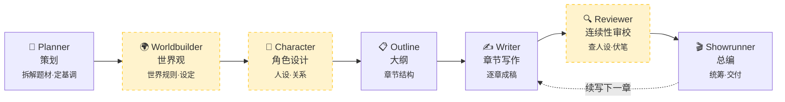

# 墨神 Mo-Shen

<p align="center">
  <strong>7 个 AI 智能体接力协作，把你的一句话灵感，写成一部完整的小说。</strong><br>
  <sub>开源 · 多模型 · 可本地部署的多智能体小说创作工作台</sub>
</p>

<p align="center">
  <a href="https://www.python.org/"></a>
  
  
  
  
  <a href="https://github.com/wwxxzz666/Mo-Shen/stargazers"></a>
</p>

<p align="center">
  <a href="#-快速开始"><b>🚀 快速开始</b></a> ·
  <a href="#-为什么是墨神"><b>✨ 特性</b></a> ·
  <a href="#-智能体流水线"><b>🤖 架构</b></a> ·
  <a href="#-路线图"><b>🗺️ 路线图</b></a> ·
  <a href="README_EN.md"><b>🌐 English</b></a>
</p>

---

> **墨神**把"写小说"拆成了一条专业流水线:**策划 → 世界观 → 角色 → 大纲 → 写作 → 审校 → 总编**,每个环节交给一个专职 AI 智能体。它们共享同一份故事记忆,接力把你的灵感推进到成稿——而不是把所有事丢给一个模型一次写完。
>
> 🎬 **在线 Demo**:`Coming Soon` · ⚡ **不想等?下面 30 秒本地启动**

---

## 📸 产品预览

<p align="center">
  
</p>
<p align="center">
  <em>黑金液态玻璃风格首页</em>
</p>

<p align="center">
  
</p>
<p align="center">
  <em>创作工作台：实时流式输出、模式切换、章节续写</em>
</p>

---

## ✨ 为什么是墨神

市面上能"AI 写小说"的工具不少，但墨神想做的是**不一样的两件事**：① 用**多个专职 Agent 接力**，而不是单模型一把梭；② **完全开源、模型自选、可本地部署**，你的故事数据不必上传到任何人的服务器。

| 能力 | 墨神 Mo-Shen | NovelAI / Sudowrite | 直接用 ChatGPT |
| :--- | :---: | :---: | :---: |
| 完全开源免费 | ✅ MIT | ❌ 订阅制 | ❌ 付费 |
| 多 Agent 分工协作 | ✅ 7 个专职 Agent | ❌ 单模型 | ❌ 单轮对话 |
| 模型自由选择 | ✅ DeepSeek / 通义 / Claude / GPT / Gemini | ❌ 锁定单一模型 | ⚠️ 单家 |
| 本地部署 · 数据不出门 | ✅ | ❌ | ❌ |
| 长篇人设/伏笔一致性 | ✅ 连续性审校 Agent | ⚠️ 一般 | ❌ 容易忘设定 |
| 项目化管理（持久化 / 续写 / 章节锁） | ✅ SQLite 记忆 | ✅ | ❌ |

---

## 🤖 智能体流水线

7 个专职 Agent 组成一条可持续推进的创作链路，按你选的**工作流模式**自动跳过或启用对应环节：



> 🟡 黄色节点为**进阶环节**，仅在更高工作流模式下启用。

### 三档工作流模式

| 模式 | 流程 | 适合场景 |
| :--- | :--- | :--- |
| ⚡ `quick` 快速出稿 | Planner → Outline → Writer → Showrunner | 试题材、试风格、先起一版 |
| 🎯 `standard` 标准创作 | + Worldbuilder + Character Designer | 中篇 / 连载，需要完整设定支撑 |
| 💎 `deep` 深度打磨 | + Continuity Reviewer，自动增加修订轮次 | 长篇、伏笔密集、人设一致性要求高 |

---

## 🚀 快速开始

### 1. 安装

```bash
git clone https://github.com/wwxxzz666/Mo-Shen.git
cd Mo-Shen
pip install -e .
```

> 需要 Python 3.10+。

### 2. 配置模型

在项目根目录创建 `.env`，填入你使用的模型 API Key（任选其一即可）：

```env
DEEPSEEK_API_KEY=sk-xxxx
# 或
OPENAI_API_KEY=sk-xxxx
ANTHROPIC_API_KEY=sk-ant-xxxx
GOOGLE_API_KEY=xxxx
```

通过环境变量切换模型与模式：

```env
STORYAGENTS_LLM_PROVIDER=deepseek        # deepseek / openai / anthropic / google
STORYAGENTS_DEEP_THINK_LLM=deepseek-chat
STORYAGENTS_QUICK_THINK_LLM=deepseek-chat
STORYAGENTS_WORKFLOW_MODE=standard       # quick / standard / deep
STORYAGENTS_OUTPUT_LANGUAGE=Chinese
```

### 3. 启动 Web 工作台（推荐）

```bash
python -m storyagents.cli serve --port 8000 --mode standard
```

浏览器打开 👉 [http://127.0.0.1:8000/h5/](http://127.0.0.1:8000/h5/)

### 4. 或者，命令行一把生成

```bash
python -m storyagents.cli draft \
  --prompt "写一个发生在海上记忆之城的悬疑故事" \
  --chapters 3 \
  --mode deep
```

<details>
<summary><b>📦 更多命令</b></summary>

```bash
# 切换工作流模式
python -m storyagents.cli serve --port 8000 --mode quick
python -m storyagents.cli serve --port 8000 --mode deep

# 运行测试
python -m pytest tests/test_storyagents_server.py -q
```
</details>

---

## 🧩 核心特性

- **🤖 多智能体协作** — 7 个专职 Agent 接力，每个环节各司其职
- **🎚️ 三档工作流** — 快速出稿 / 标准创作 / 深度打磨，按需平衡速度与质量
- **🌊 流式实时输出** — 实时看到每个 Agent 的思考与章节推进
- **💾 故事持久化** — 基于 SQLite 记忆，续写自动回写、局部编辑可保存
- **🔌 多模型自由切换** — DeepSeek、通义千问、OpenAI、Claude、Gemini，兼容 OpenAI 风格接口
- **🏠 可本地部署** — 故事数据留在你自己的机器上
- **📱 三端覆盖** — Web 工作台 / 微信小程序 / 命令行
- **📄 成稿导出** — 支持 TXT / DOCX

---

## 🏗️ 项目结构

```text
Mo-Shen/
├─ storyagents/                # 核心框架
│  ├─ agents/                  # 7 类智能体实现
│  │  ├─ planning/             #   策划 Planner
│  │  ├─ worldbuilding/        #   世界观 Worldbuilder
│  │  ├─ characters/           #   角色设计 Character Designer
│  │  ├─ outlining/            #   大纲 Outline Agent
│  │  ├─ writing/              #   章节写作 Chapter Writer
│  │  ├─ review/               #   连续性审校 Reviewer
│  │  ├─ management/           #   总编 Showrunner
│  │  └─ editing/              #   局部编辑 Editor
│  ├─ graph/                   #   LangGraph 编排与状态传播
│  ├─ llm_clients/             #   多厂商模型适配层
│  ├─ h5/                      #   Web 工作台前端
│  ├─ cli.py                   #   CLI 入口
│  └─ server.py                #   HTTP 服务与 API
├─ miniprogram/                # 微信小程序端
├─ tests/                      # 测试
├─ PRODUCT_ROADMAP.md          # 产品路线图
└─ RELEASE_NOTES.md            # 版本记录
```

---

## 🗺️ 路线图

项目正在**持续迭代**，以下为近期规划（详见 [PRODUCT_ROADMAP.md](PRODUCT_ROADMAP.md)）：

- ✅ **三档工作流模式**（quick / standard / deep）
- ✅ **故事持久化**（编辑回写、续写合并、历史记录）
- ✅ **黑金液态玻璃 UI**
- 🔜 **章节级控制** — 单章重写、锁定满意章节、先看大纲再写正文
- 🔜 **一致性面板** — 常驻角色卡 / 世界规则 / 时间线
- 🔜 **导入已有稿件** — 自动补齐大纲、人物、世界观
- 🔜 **多版本分支** — 同一故事分叉 A/B 两条剧情线
- 🔜 **作者模板库** — 保存题材 / 节奏 / 角色模板，一键复用

> 想要某个功能？欢迎 [提 Issue](https://github.com/wwxxzz666/Mo-Shen/issues) 👋

---

## 🤝 参与贡献

墨神是一个开放的开源项目，欢迎各种形式的贡献：

- 🐛 发现 Bug → [提个 Issue](https://github.com/wwxxzz666/Mo-Shen/issues)
- 💡 有新想法 → 在 Issue 里描述你的提案
- 🔧 想写代码 → Fork → 新建分支 → 提 PR

如果墨神对你有帮助，顺手点个 ⭐ Star 是对作者最大的鼓励～

---

## 📄 License

[MIT License](LICENSE) © 2026 wwxxzz666

本项目基于 [LangGraph](https://github.com/langchain-ai/langgraph) 与 [LangChain](https://github.com/langchain-ai/langchain) 构建。
