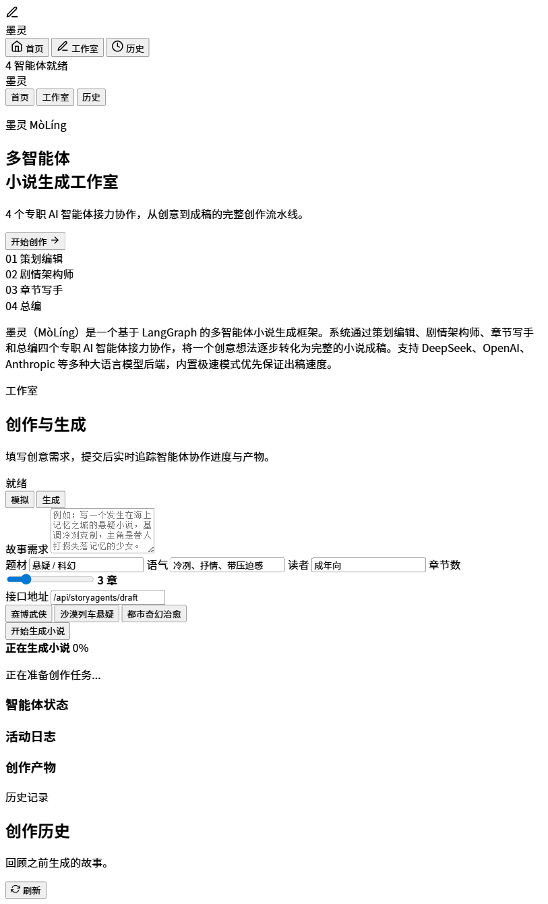

# 墨神 Mo-Shen

<p align="center">
  
  
  
  
  
</p>

<p align="center">
  <b>A multi-agent novel writing workbench — 5 specialized AI agents collaborate to take your story from spark to finished manuscript.</b>
</p>

---

多智能体小说创作工作台。`Mo-Shen` 把灵感整理、世界观设定、角色设计、章节写作、连续性审校和成稿导出串成一条可持续推进的创作链路。

## 项目预览




## 亮点

- **多智能体协作** — 策划、世界观、角色、章节、审校、总编，5 个专职 Agent 接力完成
- **三档工作流** — 快速出稿 / 标准创作 / 深度打磨，按需选择
- **流式输出** — 实时看到每个 Agent 的思考过程和章节推进
- **多模型兼容** — DeepSeek、OpenAI、Anthropic、Google 等兼容 OpenAI 风格接口的后端
- **成稿导出** — 支持 TXT / DOCX 格式

## 工作流模式

| 模式 | 流程 | 适合场景 |
| --- | --- | --- |
| `quick` | Planner → Outline Agent → Chapter Writer → Showrunner | 快速试题材、试风格、先起一版 |
| `standard` | Planner → Worldbuilder → Character Designer → Outline Agent → Chapter Writer → Showrunner | 中篇、连载、需要更完整设定支撑 |
| `deep` | Planner → Worldbuilder → Character Designer → Outline Agent → Chapter Writer → Continuity Reviewer → Showrunner | 长篇、伏笔密集、人设一致性要求高 |

## 快速开始

### 1. 安装

```bash
git clone https://github.com/wwxxzz666/Mo-Shen.git
cd Mo-Shen
pip install -e .
```

### 2. 配置

创建 `.env` 文件，填入你的模型服务配置：

```env
DEEPSEEK_API_KEY=sk-xxxx
```

也可以通过环境变量覆盖默认配置：

```env
STORYAGENTS_LLM_PROVIDER=deepseek
STORYAGENTS_DEEP_THINK_LLM=deepseek-chat
STORYAGENTS_QUICK_THINK_LLM=deepseek-chat
STORYAGENTS_WORKFLOW_MODE=standard
STORYAGENTS_OUTPUT_LANGUAGE=Chinese
```

### 3. 启动 Web 工作台

```bash
python -m storyagents.cli serve --port 8000 --mode standard
```

打开 [http://127.0.0.1:8000/h5/](http://127.0.0.1:8000/h5/)。

### 4. 命令行生成

```bash
python -m storyagents.cli draft \
  --prompt "写一个发生在海上记忆之城的悬疑故事" \
  --chapters 3 \
  --mode deep
```

## 常用命令

```bash
python -m storyagents.cli serve --port 8000 --mode quick
python -m storyagents.cli serve --port 8000 --mode standard
python -m storyagents.cli serve --port 8000 --mode deep
python -m pytest tests/test_storyagents_server.py -q
```

## Web 工作台亮点

- 黑金液态玻璃风格首页和创作工作台
- 模式切换会同步改变智能体流程和可见产物标签
- 历史卡片可直接续写已有项目
- 续写后章节会并回原故事，不再生成孤立结果

## 项目结构

```text
storyagents/
├─ agents/               # 各类智能体实现
├─ graph/                # LangGraph 编排与传播
├─ h5/                   # Web 前端
├─ llm_clients/          # 模型客户端适配
├─ cli.py                # CLI 入口
├─ server.py             # HTTP 服务与 API
└─ default_config.py     # 默认配置与环境变量映射
tests/
PRODUCT_ROADMAP.md
RELEASE_NOTES.md
```

## 最近更新

最新改动见 [RELEASE_NOTES.md](RELEASE_NOTES.md)。

## License

MIT
