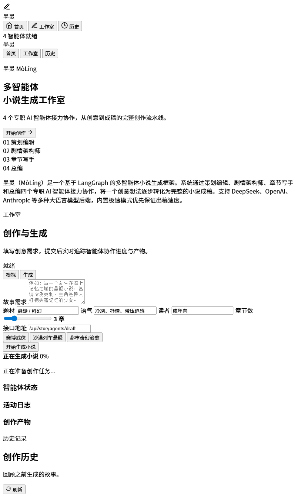
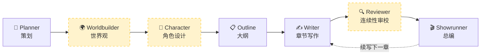

# 墨神 Mo-Shen

<p align="center">
  <strong>v2.0.1 · AgentScope 多智能体小说创作工作台</strong><br>
  <sub>分支 <code>main</code> / <code>agentscope-mo-shen</code> · 7 个专职 AI 智能体接力协作</sub>
</p>

<p align="center">
  <a href="https://www.python.org/"></a>
  
  
  
  
  
  
  <a href="https://github.com/wwxxzz666/Mo-Shen/stargazers"></a>
</p>

<p align="center">
  <a href="#-v201-更新日志"><b>🆕 版本更新</b></a> ·
  <a href="#-快速开始"><b>🚀 快速开始</b></a> ·
  <a href="#-智能体流水线"><b>🤖 架构</b></a> ·
  <a href="#-路线图"><b>🗺️ 路线图</b></a> ·
  <a href="README_EN.md"><b>🌐 English</b></a>
</p>

---

> **墨神 v2.0.1（AgentScope 版）** 把「写小说」拆成专业流水线：**策划 → 世界观 → 角色 → 大纲 → 写作 → 审校 → 总编**。
> 每个环节由专职 AI 智能体负责，共享同一份故事状态，接力推进到成稿——而不是把所有事丢给一个模型一次写完。  
>
> 本分支多智能体编排使用 **[AgentScope](https://github.com/agentscope-ai/agentscope) 2.x**。  
> 经典 LangGraph 版保留在历史标签 [`v1`](https://github.com/wwxxzz666/Mo-Shen/releases/tag/v1)。
>
> 🏷️ 当前标签：[v2.0.1](https://github.com/wwxxzz666/Mo-Shen/tree/v2.0.1) · 分支：`main` / `agentscope-mo-shen` · ⚡ 30 秒本地启动见下方

---

## 🆕 v2.0.1 更新日志

`v2.0.1` 聚焦于章节生成参数控制与工程质量，补齐了每章目标长度从界面到工作流的完整链路。

- ✅ **每章目标字数控制**：Web 工作台新增 300–5000 的长度滑块，默认 1500
- ✅ **全链路参数支持**：H5、HTTP API、CLI、工作流状态与 Writer 提示词保持一致
- ✅ **语言单位适配**：英文按单词数、中文等其他语言按非空白字符数设置目标
- ✅ **自然长度区间**：默认以目标值 ±15% 生成，避免为凑字数重复填充或机械截断
- ✅ **续写继承设置**：保存故事后继续创作时，自动沿用原有的每章目标长度
- ✅ **工程化测试增强**：补充边界值、参数传递、页面字段、持久化与续写继承测试

相关实现与讨论：[PR #4](https://github.com/wwxxzz666/Mo-Shen/pull/4) · [Issue #2](https://github.com/wwxxzz666/Mo-Shen/issues/2)

---

## 🆕 v2.0 更新了什么

这一版的核心变化是：**多智能体协作引擎从 LangGraph 全面迁移到 AgentScope**。  
产品能力（三档模式、流式输出、持久化、H5 工作台）继续保留，底层编排与依赖大幅简化。

### 相对 v1 的主要变更

| 模块 | v1 · 历史标签（LangGraph） | v2.0+ · AgentScope |
| :--- | :--- | :--- |
| 多 Agent 编排 | LangGraph `StateGraph` | **AgentScope** `Agent` + 工作流循环 |
| 局部编辑 Editor | LangChain LLM 调用 | **AgentScope Agent**（`orchestration/editor.py`） |
| 运行时依赖 | LangGraph + LangChain 全家桶 | **AgentScope 2.x** 为主 |
| 核心目录 | `agents/` + `graph/` + `llm_clients/` | **`storyagents/orchestration/`** |
| Python | 3.10+ | **3.11+** |
| 对外 API | CLI / HTTP / H5 | **兼容不变**（`StoryAgentsGraph` 接口保留） |

### 本版具体改动清单

- ✅ **编排层重写**：新增 `storyagents/orchestration/`  
  - `roles.py`：Planner / Worldbuilder / Character / Outline / Writer / Reviewer / Showrunner  
  - `workflow.py`：顺序流水线 + 审校修订环 + 章节续写环  
  - `story_graph.py`：统一入口 `generate_story` / `generate_story_stream`  
  - `editor.py`：改写 / 扩写 / 精简 / 润色  
- ✅ **依赖瘦身**：移除 LangGraph、LangChain 运行时依赖  
- ✅ **兼容层**：`storyagents.graph` 仍可导入，内部转发到 orchestration  
- ✅ **测试增强**：单元测试 + 可选真实 API smoke（`STORYAGENTS_RUN_SMOKE=1`）  
- ✅ **文档更新**：README / Release Notes 按 AgentScope 版本重写  

### 升级注意

```text
Python >= 3.11
pip install -e .          # 或 uv sync
# 旧 LangGraph 相关代码路径已删除；请使用 orchestration 入口
```

完整变更记录见 [RELEASE_NOTES.md](RELEASE_NOTES.md)。

---

## 📸 产品预览

<p align="center">
  
</p>
<p align="center">
  <em>黑金液态玻璃风格首页</em>
</p>

<p align="center">
  
</p>
<p align="center">
  <em>创作工作台：实时流式输出、模式切换、章节续写</em>
</p>

---

## ✨ 为什么是墨神

市面上能「AI 写小说」的工具不少，但墨神坚持两件事：

1. **多个专职 Agent 接力**，而不是单模型一把梭  
2. **完全开源、模型自选、可本地部署**，故事数据不必上传到别人的服务器  

| 能力 | 墨神 Mo-Shen | NovelAI / Sudowrite | 直接用 ChatGPT |
| :--- | :---: | :---: | :---: |
| 完全开源免费 | ✅ MIT | ❌ 订阅制 | ❌ 付费 |
| 多 Agent 分工协作 | ✅ 7 个专职 Agent | ❌ 单模型 | ❌ 单轮对话 |
| 编排框架 | ✅ AgentScope 2.x | — | — |
| 模型自由选择 | ✅ DeepSeek / 通义 / Claude / GPT / Gemini | ❌ 锁定单一模型 | ⚠️ 单家 |
| 本地部署 · 数据不出门 | ✅ | ❌ | ❌ |
| 长篇人设 / 伏笔一致性 | ✅ 连续性审校 Agent | ⚠️ 一般 | ❌ 容易忘设定 |
| 项目化管理（持久化 / 续写 / 编辑） | ✅ | ✅ | ❌ |

---

## 🤖 智能体流水线

7 个专职 Agent 组成可持续推进的创作链路；按你选的**工作流模式**自动启用或跳过进阶环节：


```mermaid
flowchart LR
    P["🧭 Planner<br/>策划"] --> W["🌍 Worldbuilder<br/>世界观"]
    W --> C["👤 Character<br/>角色设计"]
    C --> O["📋 Outline<br/>大纲"]
    O --> CW["✍️ Writer<br/>章节写作"]
    CW --> R["🔍 Reviewer<br/>连续性审校"]
    R --> S["🎬 Showrunner<br/>总编"]
    S -. 续写下一章 .-> CW

    classDef optional fill:#fff3cd,stroke:#ffc107,stroke-dasharray: 5 5;
    class W,C,R optional;
```

> 🟡 黄色节点为进阶环节，仅在更高工作流模式下启用。

### 三档工作流模式

| 模式 | 流程 | 适合场景 |
| :--- | :--- | :--- |
| ⚡ `quick` 快速出稿 | Planner → Outline → Writer → Showrunner | 试题材、试风格、先起一版 |
| 🎯 `standard` 标准创作 | + Worldbuilder + Character Designer | 中篇 / 连载，需要完整设定 |
| 💎 `deep` 深度打磨 | + Continuity Reviewer，提高修订轮次 | 长篇、伏笔密集、人设一致性要求高 |

### v2.0 技术架构（简图）

```text
用户请求
   │
   ▼
StoryAgentsGraph  (对外兼容入口)
   │
   ▼
StoryWorkflow     (AgentScope 编排)
   ├─ Planner Agent
   ├─ Worldbuilder / Character  (standard+)
   ├─ Outline Agent
   ├─ Chapter Writer  ◄──┐
   ├─ Continuity Reviewer ┤  (deep 模式可修订回写)
   └─ Showrunner ─────────┘  (Continue → 下一章)
   │
   ▼
成稿 / SSE 流式事件 / 故事持久化
```

---

## 🚀 快速开始

### 1. 安装

```bash
git clone https://github.com/wwxxzz666/Mo-Shen.git
cd Mo-Shen
pip install -e .
# 或：uv sync
```

> 需要 **Python 3.11+**（AgentScope 2.x 要求）。

### 2. 配置模型

在项目根目录创建 `.env`，填入 API Key（任选其一）：

```env
DEEPSEEK_API_KEY=sk-xxxx
# 或
OPENAI_API_KEY=sk-xxxx
ANTHROPIC_API_KEY=sk-ant-xxxx
GOOGLE_API_KEY=xxxx
```

常用环境变量：

```env
STORYAGENTS_LLM_PROVIDER=deepseek        # deepseek / openai / anthropic / google
STORYAGENTS_DEEP_THINK_LLM=deepseek-chat
STORYAGENTS_QUICK_THINK_LLM=deepseek-chat
STORYAGENTS_WORKFLOW_MODE=standard       # quick / standard / deep
STORYAGENTS_OUTPUT_LANGUAGE=Chinese
```

### 3. 启动 Web 工作台（推荐）

```bash
python -m storyagents.cli serve --port 8000 --mode standard
```

浏览器打开 👉 [http://127.0.0.1:8000/h5/](http://127.0.0.1:8000/h5/)

### 4. 命令行一把生成

```bash
python -m storyagents.cli draft \
  --prompt "写一个发生在海上记忆之城的悬疑故事" \
  --chapters 3 \
  --chapter-length 1500 \
  --mode deep
```

<details>
<summary><b>📦 更多命令</b></summary>

```bash
# 切换工作流模式
python -m storyagents.cli serve --port 8000 --mode quick
python -m storyagents.cli serve --port 8000 --mode deep

# 运行单元测试
python -m pytest tests -q

# 真实 API smoke（需显式开启 + Key）
# PowerShell:
#   $env:STORYAGENTS_RUN_SMOKE="1"
#   $env:DEEPSEEK_API_KEY="sk-..."
python -m pytest tests/test_real_api_smoke.py -m smoke -q
```
</details>

---

## 🧩 核心特性

- **🤖 AgentScope 多智能体协作** — 7 个专职 Agent 接力，状态共享、环节清晰  
- **🎚️ 三档工作流** — 快速出稿 / 标准创作 / 深度打磨  
- **🌊 流式实时输出** — 每个 Agent 节点完成事件可 SSE 推送  
- **💾 故事持久化** — 续写合并、局部编辑回写、历史记录  
- **✏️ 局部编辑** — rewrite / expand / compress / polish（AgentScope Editor）  
- **🔌 多模型自由切换** — DeepSeek、通义、OpenAI、Claude、Gemini 等  
- **🏠 可本地部署** — 故事数据留在你自己的机器上  
- **📱 三端覆盖** — Web 工作台 / 微信小程序 / 命令行  

---

## 🏗️ 项目结构

```text
Mo-Shen/
├─ storyagents/
│  ├─ orchestration/           # v2.0 核心：AgentScope 编排
│  │  ├─ roles.py              #   7 类创作 Agent
│  │  ├─ editor.py             #   局部编辑
│  │  ├─ workflow.py           #   流水线与修订/续写循环
│  │  ├─ models.py             #   AgentScope 模型工厂
│  │  └─ story_graph.py        #   对外统一入口
│  ├─ graph/                   # 兼容层（转发到 orchestration）
│  ├─ h5/                      # Web 工作台
│  ├─ cli.py                   # CLI
│  └─ server.py                # HTTP API
├─ miniprogram/                # 微信小程序
├─ tests/                      # 单元测试 + 可选 smoke
├─ PRODUCT_ROADMAP.md
└─ RELEASE_NOTES.md
```

---

## 🗺️ 路线图

项目持续迭代（详见 [PRODUCT_ROADMAP.md](PRODUCT_ROADMAP.md)）：

- ✅ **v2.0 AgentScope 编排迁移**（本分支）
- ✅ 三档工作流（quick / standard / deep）
- ✅ 故事持久化（编辑回写、续写合并）
- ✅ 黑金液态玻璃 UI
- ✅ 每章目标字数控制（300–5000，续写自动继承）
- 🔜 章节级控制 — 单章重写、锁定满意章节  
- 🔜 一致性面板 — 角色卡 / 世界规则 / 时间线  
- 🔜 导入已有稿件 — 自动补齐大纲、人物、世界观  
- 🔜 多版本分支 — 同一故事分叉 A/B 剧情线  
- 🔜 作者模板库 — 题材 / 节奏 / 角色模板一键复用  

> 想要某个功能？欢迎 [提 Issue](https://github.com/wwxxzz666/Mo-Shen/issues) 👋

---

## 🔀 版本与分支

| 版本 | 分支 | 标签 | 说明 |
| :--- | :--- | :--- | :--- |
| **v2.0.1** | [`main`](https://github.com/wwxxzz666/Mo-Shen/tree/main) / [`agentscope-mo-shen`](https://github.com/wwxxzz666/Mo-Shen/tree/agentscope-mo-shen) | [`v2.0.1`](https://github.com/wwxxzz666/Mo-Shen/tree/v2.0.1) | 新增每章目标字数控制与相关工程化测试 |
| **v1** | 历史标签 | [`v1`](https://github.com/wwxxzz666/Mo-Shen/releases/tag/v1) | 经典 LangGraph 版 |
| **v2.0** | 历史标签 | [`v2.0`](https://github.com/wwxxzz666/Mo-Shen/releases/tag/v2.0) | AgentScope 迁移版本 |

```bash
# 使用最新 v2.0.1（默认 main）
git clone https://github.com/wwxxzz666/Mo-Shen.git

# 使用持续更新的 AgentScope 分支
git clone -b agentscope-mo-shen https://github.com/wwxxzz666/Mo-Shen.git

# 使用历史 v1 版本
git clone --branch v1 https://github.com/wwxxzz666/Mo-Shen.git
```

---

## 🤝 参与贡献

- 🐛 发现 Bug → [提 Issue](https://github.com/wwxxzz666/Mo-Shen/issues)  
- 💡 有新想法 → 在 Issue 里描述提案  
- 🔧 想写代码 → Fork → 新建分支 → 提 PR  

如果墨神对你有帮助，点个 ⭐ Star 是对作者最大的鼓励～

---

## 📄 License

[MIT License](LICENSE) © 2026 wwxxzz666

**v2.0.1** 基于 [AgentScope](https://github.com/agentscope-ai/agentscope) 构建。
**v1（历史版本）** 基于 LangGraph / LangChain。
