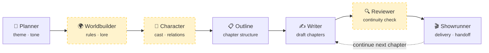

# 墨神 Mo-Shen

<p align="center">
  <strong>Seven specialized AI agents, working in relay, turn your one-line spark into a finished novel.</strong><br>
  <sub>Open-source · Multi-model · Self-hostable multi-agent novel writing workbench</sub>
</p>

<p align="center">
  <a href="https://www.python.org/"></a>
  
  
  
  
  <a href="https://github.com/wwxxzz666/Mo-Shen/stargazers"></a>
</p>

<p align="center">
  <a href="#-quick-start"><b>🚀 Quick Start</b></a> ·
  <a href="#-why-mo-shen"><b>✨ Features</b></a> ·
  <a href="#-agent-pipeline"><b>🤖 Architecture</b></a> ·
  <a href="#-roadmap"><b>🗺️ Roadmap</b></a> ·
  <a href="README.md"><b>🇨🇳 简体中文</b></a>
</p>

---

> **Mo-Shen** (墨神) breaks novel-writing into a professional pipeline: **Planning → Worldbuilding → Characters → Outline → Writing → Review → Showrunning**. Each stage is handled by a dedicated AI agent, and they share a single story memory — advancing your idea toward a finished manuscript in relay, instead of dumping everything onto one model in a single shot.
>
> 🎬 **Live Demo**: `Coming Soon` · ⚡ **Can't wait? Spin it up locally in 30 seconds below.**

---

## 📸 Preview

<p align="center">
  
</p>
<p align="center">
  <em>Homepage — black-and-gold liquid-glass UI</em>
</p>

<p align="center">
  
</p>
<p align="center">
  <em>Studio — real-time streaming, workflow modes, chapter continuation</em>
</p>

---

## ✨ Why Mo-Shen

There are plenty of tools that "write novels with AI." Mo-Shen is built around two deliberate differences: ① it uses **multiple specialized agents working in relay** rather than a single model doing everything at once; and ② it is **fully open-source, model-agnostic, and self-hostable** — your story data never has to leave your machine.

| Capability | Mo-Shen | NovelAI / Sudowrite | Plain ChatGPT |
| :--- | :---: | :---: | :---: |
| Fully open-source & free | ✅ MIT | ❌ Subscription | ❌ Paid |
| Multi-agent collaboration | ✅ 7 dedicated agents | ❌ Single model | ❌ Single turn |
| Free choice of model | ✅ DeepSeek / Qwen / Claude / GPT / Gemini | ❌ Locked to one | ⚠️ Single vendor |
| Self-host · data stays local | ✅ | ❌ | ❌ |
| Long-form consistency | ✅ Continuity-review agent | ⚠️ Limited | ❌ Forgets settings |
| Project management (persist / continue / lock chapters) | ✅ SQLite memory | ✅ | ❌ |

---

## 🤖 Agent Pipeline

Seven dedicated agents form a creation chain that keeps moving your story forward. Depending on the **workflow mode** you pick, certain stages are automatically skipped or enabled:



> 🟡 Yellow nodes are **advanced stages**, enabled only in higher workflow modes.

### Three Workflow Modes

| Mode | Pipeline | Best for |
| :--- | :--- | :--- |
| ⚡ `quick` | Planner → Outline → Writer → Showrunner | Try a genre, test a style, get a first draft fast |
| 🎯 `standard` | + Worldbuilder + Character Designer | Novellas / serials that need solid world & cast |
| 💎 `deep` | + Continuity Reviewer, more revision rounds | Long-form, dense foreshadowing, strict consistency |

---

## 🚀 Quick Start

### 1. Install

```bash
git clone https://github.com/wwxxzz666/Mo-Shen.git
cd Mo-Shen
pip install -e .
```

> Requires Python 3.10+.

### 2. Configure a model

Create a `.env` in the project root with the API key of the model you want to use (any one is enough):

```env
DEEPSEEK_API_KEY=sk-xxxx
# or
OPENAI_API_KEY=sk-xxxx
ANTHROPIC_API_KEY=sk-ant-xxxx
GOOGLE_API_KEY=xxxx
```

Switch models and modes via environment variables:

```env
STORYAGENTS_LLM_PROVIDER=deepseek        # deepseek / openai / anthropic / google
STORYAGENTS_DEEP_THINK_LLM=deepseek-chat
STORYAGENTS_QUICK_THINK_LLM=deepseek-chat
STORYAGENTS_WORKFLOW_MODE=standard       # quick / standard / deep
STORYAGENTS_OUTPUT_LANGUAGE=English
```

### 3. Launch the Web studio (recommended)

```bash
python -m storyagents.cli serve --port 8000 --mode standard
```

Open 👉 [http://127.0.0.1:8000/h5/](http://127.0.0.1:8000/h5/) in your browser.

### 4. Or generate from the CLI

```bash
python -m storyagents.cli draft \
  --prompt "A suspense story set in a city of memory on the sea" \
  --chapters 3 \
  --mode deep
```

<details>
<summary><b>📦 More commands</b></summary>

```bash
# Switch workflow modes
python -m storyagents.cli serve --port 8000 --mode quick
python -m storyagents.cli serve --port 8000 --mode deep

# Run tests
python -m pytest tests/test_storyagents_server.py -q
```
</details>

---

## 🧩 Key Features

- **🤖 Multi-agent collaboration** — 7 dedicated agents, each owning one stage of the craft
- **🎚️ Three workflow modes** — quick / standard / deep, trade speed vs. quality on demand
- **🌊 Real-time streaming** — watch every agent's reasoning and chapter progress live
- **💾 Story persistence** — SQLite-backed memory; continuations write back, edits are saved
- **🔌 Model-agnostic** — DeepSeek, Qwen, OpenAI, Claude, Gemini — anything with an OpenAI-style API
- **🏠 Self-hostable** — your story data stays on your own machine
- **📱 Three front-ends** — Web studio / WeChat Mini Program / CLI
- **📄 Export** — TXT / DOCX

---

## 🏗️ Project Structure

```text
Mo-Shen/
├─ storyagents/                # Core framework
│  ├─ agents/                  # 7 agent implementations
│  │  ├─ planning/             #   Planner
│  │  ├─ worldbuilding/        #   Worldbuilder
│  │  ├─ characters/           #   Character Designer
│  │  ├─ outlining/            #   Outline Agent
│  │  ├─ writing/              #   Chapter Writer
│  │  ├─ review/               #   Continuity Reviewer
│  │  ├─ management/           #   Showrunner
│  │  └─ editing/              #   Editor (local edits)
│  ├─ graph/                   #   LangGraph orchestration & state propagation
│  ├─ llm_clients/             #   Multi-vendor model adapter layer
│  ├─ h5/                      #   Web studio frontend
│  ├─ cli.py                   #   CLI entry
│  └─ server.py                #   HTTP service & API
├─ miniprogram/                # WeChat Mini Program
├─ tests/                      # Tests
├─ PRODUCT_ROADMAP.md          # Product roadmap
└─ RELEASE_NOTES.md            # Release log
```

---

## 🗺️ Roadmap

Mo-Shen is **actively developed**. Recent and upcoming work (full detail in [PRODUCT_ROADMAP.md](PRODUCT_ROADMAP.md)):

- ✅ **Three workflow modes** (quick / standard / deep)
- ✅ **Story persistence** (edit write-back, continuation merge, history)
- ✅ **Black-and-gold liquid-glass UI**
- 🔜 **Chapter-level control** — rewrite a single chapter, lock finished ones, approve outline before drafting
- 🔜 **Consistency panel** — always-on character cards / world rules / timeline
- 🔜 **Import existing manuscripts** — auto-fill outline, characters, worldbuilding
- 🔜 **Branching versions** — fork A/B plotlines from the same story
- 🔜 **Author template library** — save genre / pacing / character templates, reuse in one click

> Want a feature? Open an [Issue](https://github.com/wwxxzz666/Mo-Shen/issues) 👋

---

## 🤝 Contributing

Mo-Shen is an open project — contributions of any kind are welcome:

- 🐛 Found a bug → [open an Issue](https://github.com/wwxxzz666/Mo-Shen/issues)
- 💡 Have an idea → describe your proposal in an Issue
- 🔧 Want to code → Fork → new branch → open a PR

If Mo-Shen helps you, a ⭐ Star means a lot to the author.

---

## 📄 License

[MIT License](LICENSE) © 2026 wwxxzz666

Built on top of [LangGraph](https://github.com/langchain-ai/langgraph) and [LangChain](https://github.com/langchain-ai/langchain).
