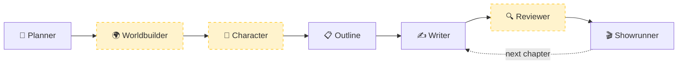

# Mo-Shen (墨神)

<p align="center">
  <strong>v2.0 · AgentScope Multi-Agent Novel Workbench</strong><br>
  <sub>Branch <code>agentscope-mo-shen</code> · seven specialized AI agents in relay</sub>
</p>

<p align="center">
  <a href="https://www.python.org/"></a>
  
  
  
  
  
  
  <a href="https://github.com/wwxxzz666/Mo-Shen/stargazers"></a>
</p>

<p align="center">
  <a href="#-whats-new-in-v20"><b>🆕 What's New</b></a> ·
  <a href="#-quick-start"><b>🚀 Quick Start</b></a> ·
  <a href="#-agent-pipeline"><b>🤖 Architecture</b></a> ·
  <a href="#-roadmap"><b>🗺️ Roadmap</b></a> ·
  <a href="README.md"><b>🇨🇳 简体中文</b></a>
</p>

---

> **Mo-Shen v2.0 (AgentScope edition)** breaks novel writing into a professional pipeline:  
> **Planning → Worldbuilding → Characters → Outline → Writing → Review → Showrunning**.  
> Each stage is owned by a dedicated agent sharing one story state — not a single model doing everything at once.  
>
> This branch runs on **[AgentScope](https://github.com/agentscope-ai/agentscope) 2.x**.  
> Classic LangGraph edition: default branch [`main`](https://github.com/wwxxzz666/Mo-Shen/tree/main) (tag [`v1`](https://github.com/wwxxzz666/Mo-Shen/releases/tag/v1)).  
>
> 🏷️ Tag: [v2.0](https://github.com/wwxxzz666/Mo-Shen/releases/tag/v2.0) · Branch: `agentscope-mo-shen`

---

## 🆕 What's New in v2.0

The headline change: **multi-agent orchestration moved from LangGraph to AgentScope**.  
Product features (workflow modes, streaming, persistence, H5 studio) remain; the runtime stack is simpler.

### v1 (main) → v2.0 (this branch)

| Area | v1 · main (LangGraph) | v2.0 · agentscope-mo-shen |
| :--- | :--- | :--- |
| Orchestration | LangGraph `StateGraph` | **AgentScope** `Agent` + workflow loop |
| Local editor | LangChain LLM calls | **AgentScope Agent** (`orchestration/editor.py`) |
| Runtime deps | LangGraph + LangChain stack | **AgentScope 2.x** first |
| Core package layout | `agents/` + `graph/` + `llm_clients/` | **`storyagents/orchestration/`** |
| Python | 3.10+ | **3.11+** |
| Public API | CLI / HTTP / H5 | **Compatible** (`StoryAgentsGraph` kept) |

### Changelog highlights

- ✅ New `storyagents/orchestration/` (roles, workflow, editor, model factory)  
- ✅ Dropped LangGraph / LangChain runtime dependencies  
- ✅ Compatibility shim: `storyagents.graph` re-exports orchestration  
- ✅ Unit tests + optional live API smoke (`STORYAGENTS_RUN_SMOKE=1`)  
- ✅ Docs rewritten for the AgentScope edition  

See [RELEASE_NOTES.md](RELEASE_NOTES.md) for the full log.

---

## 📸 Preview

<p align="center">
  
</p>
<p align="center">
  <em>Homepage — black-and-gold liquid-glass UI</em>
</p>

<p align="center">
  
</p>
<p align="center">
  <em>Studio — streaming output, workflow modes, chapter continuation</em>
</p>

---

## ✨ Why Mo-Shen

1. **Multiple specialized agents in relay**, not one model for everything  
2. **Open-source, model-agnostic, self-hostable** — story data can stay on your machine  

| Capability | Mo-Shen | NovelAI / Sudowrite | Plain ChatGPT |
| :--- | :---: | :---: | :---: |
| Open-source & free | ✅ MIT | ❌ Subscription | ❌ Paid |
| Multi-agent collaboration | ✅ 7 agents | ❌ Single model | ❌ Single turn |
| Orchestration | ✅ AgentScope 2.x | — | — |
| Model choice | ✅ DeepSeek / Qwen / Claude / GPT / Gemini | ❌ Locked | ⚠️ One vendor |
| Self-host · local data | ✅ | ❌ | ❌ |
| Long-form consistency | ✅ Continuity reviewer | ⚠️ Limited | ❌ |
| Project management | ✅ Persist / continue / edit | ✅ | ❌ |

---

## 🤖 Agent Pipeline


```mermaid
flowchart LR
    P["🧭 Planner"] --> W["🌍 Worldbuilder"]
    W --> C["👤 Character"]
    C --> O["📋 Outline"]
    O --> CW["✍️ Writer"]
    CW --> R["🔍 Reviewer"]
    R --> S["🎬 Showrunner"]
    S -. next chapter .-> CW

    classDef optional fill:#fff3cd,stroke:#ffc107,stroke-dasharray: 5 5;
    class W,C,R optional;
```

> 🟡 Yellow nodes are advanced stages, enabled only in higher workflow modes.

| Mode | Flow | Best for |
| :--- | :--- | :--- |
| ⚡ `quick` | Planner → Outline → Writer → Showrunner | Fast drafts |
| 🎯 `standard` | + Worldbuilder + Character | Mid-length / serials |
| 💎 `deep` | + Continuity Reviewer, more revision rounds | Long-form consistency |

---

## 🚀 Quick Start

### 1. Install

```bash
git clone https://github.com/wwxxzz666/Mo-Shen.git
cd Mo-Shen
pip install -e .
# or: uv sync
```

> Requires **Python 3.11+**.

### 2. Configure a model

Create `.env` with one of:

```env
DEEPSEEK_API_KEY=sk-xxxx
# or OPENAI_API_KEY / ANTHROPIC_API_KEY / GOOGLE_API_KEY
```

### 3. Start the Web studio

```bash
python -m storyagents.cli serve --port 8000 --mode standard
```

Open [http://127.0.0.1:8000/h5/](http://127.0.0.1:8000/h5/)

### 4. Or draft from CLI

```bash
python -m storyagents.cli draft \
  --prompt "A mystery set in a city of drowned memories" \
  --chapters 3 \
  --mode deep
```

---

## 🏗️ Project Structure

```text
Mo-Shen/
├─ storyagents/
│  ├─ orchestration/     # AgentScope multi-agent core (v0.2+)
│  ├─ graph/             # Compatibility re-export
│  ├─ h5/                # Web studio
│  ├─ cli.py
│  └─ server.py
├─ miniprogram/
├─ tests/
└─ RELEASE_NOTES.md
```

---

## 🗺️ Roadmap

- ✅ **v0.2 AgentScope migration**
- ✅ Workflow modes + persistence + liquid-glass UI
- 🔜 Chapter-level controls  
- 🔜 Consistency panel  
- 🔜 Import existing manuscripts  
- 🔜 A/B story branches  
- 🔜 Author template library  

---

## 🔀 Versions & Branches

| Version | Branch | Tag | Notes |
| :--- | :--- | :--- | :--- |
| **v1** | [`main`](https://github.com/wwxxzz666/Mo-Shen/tree/main) | [`v1`](https://github.com/wwxxzz666/Mo-Shen/releases/tag/v1) | Classic LangGraph edition (default) |
| **v2.0** | [`agentscope-mo-shen`](https://github.com/wwxxzz666/Mo-Shen/tree/agentscope-mo-shen) | [`v2.0`](https://github.com/wwxxzz666/Mo-Shen/releases/tag/v2.0) | AgentScope edition (this branch) |

```bash
# v1 (default)
git clone https://github.com/wwxxzz666/Mo-Shen.git

# v2.0 AgentScope
git clone -b agentscope-mo-shen https://github.com/wwxxzz666/Mo-Shen.git
```

---

## 📄 License

[MIT License](LICENSE) © 2026 wwxxzz666

**v2.0 (this branch)** is built on [AgentScope](https://github.com/agentscope-ai/agentscope).  
**v1 (main)** uses LangGraph / LangChain.
